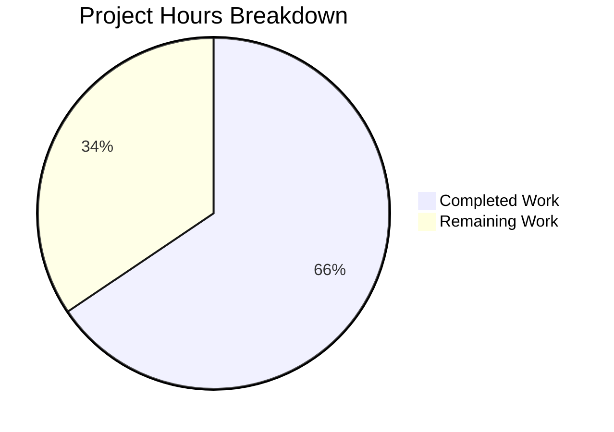

# Project Guide: Burger Palace Restaurant Website

## Executive Summary

**Project Completion: 66% (59 hours completed out of 90 total hours)**

This project implements a fully functional Burger Palace restaurant website using Vite.js, React 19, and TypeScript. The application features online ordering, user authentication, table booking, and responsive design. All core frontend functionality has been implemented and validated.

### Key Achievements
- Complete frontend application with 9 pages and 9 reusable components
- State management using Zustand with browser persistence
- TypeScript with comprehensive type definitions (0 compilation errors)
- ESLint configured and passing (0 linting errors)
- Production build successful (311.84 KB bundle)
- Development and preview servers working correctly

### Critical Remaining Work
- Unit tests need implementation (currently placeholder)
- Backend API integration required for production (currently mock data)
- Production deployment configuration needed

---

## Validation Results Summary

### Dependencies
| Status | Details |
|--------|---------|
| ✅ PASS | 240 npm packages installed successfully |
| | Key packages: React 19, React Router 7, Zustand 5, Tailwind CSS 3, Vite 6 |

### Compilation
| Check | Status | Details |
|-------|--------|---------|
| TypeScript | ✅ PASS | 0 errors |
| Vite Build | ✅ PASS | 1673 modules transformed |
| Bundle Size | ✅ PASS | index.js: 311.84 KB, index.css: 22.57 KB |

### Linting
| Status | Details |
|--------|---------|
| ✅ PASS | ESLint: 0 errors |

### Tests
| Status | Details |
|--------|---------|
| ⚠️ PLACEHOLDER | Test script echoes "No tests specified" |
| | Unit tests need to be implemented |

### Runtime
| Status | Details |
|--------|---------|
| ✅ PASS | Development server starts on port 5173 |
| ✅ PASS | Preview server serves production build |
| ✅ PASS | HTML and assets served correctly |

---

## Project Hours Breakdown



**Completed: 59 hours | Remaining: 31 hours | Total: 90 hours | Completion: 66%**

### Completed Hours Detail
| Component | Hours | Description |
|-----------|-------|-------------|
| Project Setup | 4h | Vite, TypeScript, ESLint, Tailwind configuration |
| Components | 14h | 9 reusable React components |
| Pages | 18h | 9 page components with routing |
| State Management | 8h | 4 Zustand stores with persistence |
| Type Definitions | 3h | Comprehensive TypeScript interfaces |
| Data & Assets | 3h | Menu items data and configuration |
| Styling | 6h | Tailwind CSS styling and responsive design |
| Documentation | 1h | README with setup instructions |
| Build Config | 2h | Vite and build optimization |
| **Total** | **59h** | |

### Remaining Hours Detail
| Task | Hours | Priority | Description |
|------|-------|----------|-------------|
| Unit Tests | 8h | High | Jest/Vitest test suite implementation |
| Backend API | 12h | High | Replace mock data with real API calls |
| Deployment | 4h | Medium | CI/CD and hosting configuration |
| Environment Config | 2h | Medium | Environment variables setup |
| Error Handling | 2h | Medium | Enhanced error boundaries and handling |
| Security Review | 3h | Low | Security audit and hardening |
| **Total** | **31h** | | |

---

## Detailed Human Task List

### High Priority Tasks

| # | Task | Description | Hours | Severity |
|---|------|-------------|-------|----------|
| 1 | Implement Unit Tests | Create test suite using Vitest or Jest. Cover all components, stores, and utility functions. Add to CI pipeline. | 8h | High |
| 2 | Backend API Integration | Replace mock authentication with real API. Connect order creation to backend. Integrate booking system with server. | 12h | High |

### Medium Priority Tasks

| # | Task | Description | Hours | Severity |
|---|------|-------------|-------|----------|
| 3 | Production Deployment | Configure hosting (Vercel/Netlify/AWS). Set up CI/CD pipeline. Configure domain and SSL. | 4h | Medium |
| 4 | Environment Configuration | Create .env files for different environments. Set up environment variable handling. Document required variables. | 2h | Medium |
| 5 | Error Handling Improvements | Add error boundaries to React components. Improve error messages and user feedback. Add retry mechanisms for API calls. | 2h | Medium |

### Low Priority Tasks

| # | Task | Description | Hours | Severity |
|---|------|-------------|-------|----------|
| 6 | Security Review | Review authentication flow. Add CSRF protection. Implement rate limiting. Security headers configuration. | 3h | Low |

**Total Remaining Hours: 31 hours**

---

## Development Guide

### System Prerequisites

| Requirement | Version | Notes |
|-------------|---------|-------|
| Node.js | 18.0+ | LTS version recommended |
| npm | 9.0+ | Included with Node.js |
| Git | 2.x+ | For version control |

### Environment Setup

1. **Clone the repository:**
```bash
git clone <repository-url>
cd burger-restaurant
```

2. **Install dependencies:**
```bash
npm install
```
Expected output: Successfully installed 240 packages

### Running the Application

#### Development Mode
```bash
npm run dev
```
- Server starts at: `http://localhost:5173`
- Hot module replacement enabled
- Auto-refresh on file changes

#### Production Build
```bash
npm run build
```
Expected output:
```
✓ 1673 modules transformed
dist/index.html          0.72 kB
dist/assets/index.css   22.57 kB
dist/assets/index.js   311.84 kB
✓ built in ~1.5s
```

#### Preview Production Build
```bash
npm run preview
```
- Server starts at: `http://localhost:4173`
- Serves the built `dist` directory

#### Linting
```bash
npm run lint
```
Expected output: No errors

### Verification Steps

1. **Verify Development Server:**
```bash
npm run dev
# Open http://localhost:5173 in browser
# Expect: Burger Palace homepage loads
```

2. **Verify Build:**
```bash
npm run build
# Expect: Build completes with 0 errors
# Expect: dist/ directory created with index.html and assets
```

3. **Verify TypeScript:**
```bash
npx tsc --noEmit
# Expect: Exit code 0, no errors
```

4. **Verify ESLint:**
```bash
npm run lint
# Expect: Exit code 0, no errors
```

### Project Structure

```
burger-restaurant/
├── src/
│   ├── components/          # Reusable UI components
│   │   ├── auth/           # LoginForm, RegisterForm
│   │   ├── booking/        # BookingForm
│   │   ├── cart/           # CartItemCard
│   │   ├── layout/         # Navbar, Footer, Layout
│   │   └── menu/           # MenuItemCard, CategoryFilter
│   ├── data/               # Static data (menuItems.ts)
│   ├── pages/              # Page components (9 pages)
│   ├── store/              # Zustand stores (auth, cart, order, booking)
│   ├── types/              # TypeScript type definitions
│   ├── App.tsx             # Main app with routing
│   ├── main.tsx            # Application entry point
│   └── index.css           # Global Tailwind styles
├── public/                 # Static assets
├── dist/                   # Production build output
├── package.json            # Dependencies and scripts
├── tsconfig.json           # TypeScript configuration
├── vite.config.ts          # Vite configuration
├── tailwind.config.js      # Tailwind CSS configuration
└── README.md               # Project documentation
```

### Demo Credentials

For testing the login functionality:
- **Email:** demo@burgerpalace.com
- **Password:** demo123

### Available Scripts

| Script | Command | Description |
|--------|---------|-------------|
| dev | `npm run dev` | Start development server |
| build | `npm run build` | Build for production |
| preview | `npm run preview` | Preview production build |
| lint | `npm run lint` | Run ESLint |
| test | `npm test` | Run tests (placeholder) |

---

## Risk Assessment

### Technical Risks

| Risk | Severity | Likelihood | Mitigation |
|------|----------|------------|------------|
| No unit tests | High | Certain | Implement test suite before production deployment |
| Mock authentication | High | Certain | Integrate real authentication backend |
| Client-side only state | Medium | High | Add backend persistence for orders/bookings |

### Security Risks

| Risk | Severity | Likelihood | Mitigation |
|------|----------|------------|------------|
| No real authentication | High | Certain | Implement proper auth with JWT/sessions |
| Client-side password storage | High | Certain | Move to server-side authentication |
| No HTTPS in development | Low | Low | Use HTTPS in production |

### Operational Risks

| Risk | Severity | Likelihood | Mitigation |
|------|----------|------------|------------|
| No error monitoring | Medium | High | Add error tracking service (Sentry) |
| No analytics | Low | High | Add analytics tracking |
| No backup strategy | Medium | Medium | Implement when backend is added |

### Integration Risks

| Risk | Severity | Likelihood | Mitigation |
|------|----------|------------|------------|
| API compatibility | Medium | Medium | Design API contracts before implementation |
| Payment integration | High | Certain | Integrate payment processor for real orders |
| Image hosting | Low | Medium | Use CDN for menu images |

---

## Git Commit Summary

| Metric | Value |
|--------|-------|
| Total Commits | 12 |
| Files Changed | 43 |
| Lines Added | 9,156 |
| Lines Removed | 2 |
| Net Change | +9,154 lines |

### Key Commits
1. `95d21e0` - Create Burger Palace website with Vite.js and TypeScript
2. `b22ad18` - Add Python-related entries to .gitignore
3. Previous commits - Initial Flask migration (superseded)

---

## Conclusion

The Burger Palace website is a functional frontend application with all core features implemented. The application compiles, builds, and runs without errors. The main remaining work involves:

1. **Implementing real unit tests** to replace the placeholder
2. **Connecting a backend API** to replace mock data
3. **Setting up production deployment** infrastructure

The project is estimated at **66% complete** with **59 hours of work completed** and **31 hours remaining** for production readiness.

---

*Generated by Blitzy Project Guide Generator*