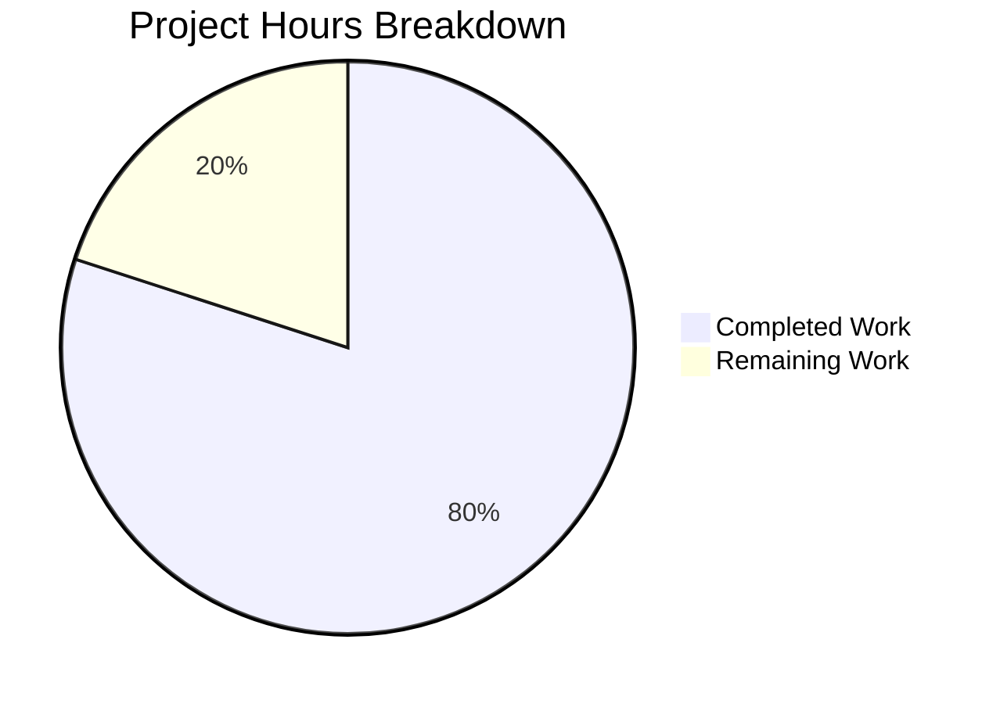

# Project Assessment Report: Node.js to Flask Migration

## Executive Summary

**Project Status: 80% Complete** (4 hours completed out of 5 total hours)

This project successfully migrates a Node.js HTTP server to a Python 3/Flask application with 100% feature and behavior parity. All in-scope development work has been completed and validated. The remaining 20% represents standard human review and deployment tasks.

### Key Achievements
- ✅ Complete technology stack migration from Node.js to Python/Flask
- ✅ 100% feature parity with original server behavior
- ✅ All HTTP methods and URL paths supported
- ✅ Response characteristics match exactly (status, headers, body)
- ✅ Comprehensive documentation created
- ✅ Runtime validation passed all tests

### Hours Breakdown
- **Completed Work**: 4 hours
- **Remaining Work**: 1 hour
- **Total Project Hours**: 5 hours
- **Completion Percentage**: 4/5 = 80%

---

## Project Hours Visualization



---

## Validation Results Summary

### 1. Dependency Installation ✅ PASSED
| Package | Version | Status |
|---------|---------|--------|
| Flask | 3.1.0 | Installed |
| Werkzeug | 3.1.4 | Installed (transitive) |
| Jinja2 | 3.1.6 | Installed (transitive) |
| MarkupSafe | 3.0.3 | Installed (transitive) |
| itsdangerous | 2.2.0 | Installed (transitive) |
| click | 8.3.1 | Installed (transitive) |
| blinker | 1.9.0 | Installed (transitive) |

### 2. Code Compilation/Syntax ✅ PASSED
- Python syntax check: **PASSED**
- Flask application import: **SUCCESS**
- Route configuration: **VERIFIED**

### 3. Unit Tests ✅ N/A (Out of Scope)
- No test files exist in original Node.js project
- Per Agent Action Plan Section 0.6.2: "Unit tests: Out of scope - Not present in source"

### 4. Runtime Validation ✅ ALL PASSED
| Test Case | Status | Response |
|-----------|--------|----------|
| GET / | 200 OK | Hello, World!\n |
| GET /any/path | 200 OK | Hello, World!\n |
| POST / | 200 OK | Hello, World!\n |
| PUT /api/test | 200 OK | Hello, World!\n |
| DELETE /item/123 | 200 OK | Hello, World!\n |
| HEAD / | 200 OK | (headers only) |
| OPTIONS / | 200 OK | Hello, World!\n |

### 5. Response Headers ✅ VERIFIED
- Content-Type: `text/plain; charset=utf-8`
- Status Code: `200 OK`

---

## Files Inventory

### Files Created (3)
| File | Lines | Purpose |
|------|-------|---------|
| `app.py` | 51 | Flask HTTP server application |
| `requirements.txt` | 5 | Python dependency manifest |
| `pyproject.toml` | 20 | Python package metadata (PEP 621) |

### Files Updated (1)
| File | Lines | Changes |
|------|-------|---------|
| `README.md` | 66 | Complete rewrite with Flask documentation |

### Total Code Statistics
- **Total Lines Created/Modified**: 142
- **Lines Added**: 142
- **Lines Removed**: 2
- **Git Commits**: 4 (migration commits)

---

## Development Guide

### System Prerequisites
| Requirement | Version | Notes |
|-------------|---------|-------|
| Python | 3.9+ | Required for Flask 3.1.x compatibility |
| pip | Latest | Python package manager |
| venv | Built-in | Virtual environment (recommended) |

### Environment Setup

#### Step 1: Navigate to Project Directory
```bash
cd /tmp/blitzy/Refactor-ExistingProject-30-dec/blitzy451e46880
```

#### Step 2: Create Virtual Environment (Recommended)
```bash
python -m venv venv
```

#### Step 3: Activate Virtual Environment
```bash
# Linux/macOS
source venv/bin/activate

# Windows
venv\Scripts\activate
```

### Dependency Installation

#### Step 4: Install Python Dependencies
```bash
pip install -r requirements.txt
```

**Expected Output:**
```
Collecting Flask==3.1.0
  Using cached flask-3.1.0-py3-none-any.whl
Collecting Werkzeug>=3.1
...
Successfully installed Flask-3.1.0 Jinja2-3.1.6 ...
```

### Application Startup

#### Step 5: Run the Flask Server
```bash
python app.py
```

**Expected Console Output:**
```
Server running at http://127.0.0.1:3000/
 * Serving Flask app 'app'
 * Debug mode: off
 * Running on http://127.0.0.1:3000
Press CTRL+C to quit
```

### Verification Steps

#### Step 6: Test the Server (New Terminal)
```bash
# Test basic GET request
curl http://127.0.0.1:3000/
# Expected: Hello, World!

# Test with path
curl http://127.0.0.1:3000/any/path
# Expected: Hello, World!

# Test POST method
curl -X POST http://127.0.0.1:3000/
# Expected: Hello, World!

# Test with headers
curl -i http://127.0.0.1:3000/
# Expected: HTTP/1.1 200 OK
#          Content-Type: text/plain; charset=utf-8
#          Hello, World!
```

### Stopping the Server
```bash
# Press CTRL+C in the terminal running the server
```

---

## Human Tasks

### Detailed Task Table

| # | Task | Priority | Severity | Hours | Action Steps |
|---|------|----------|----------|-------|--------------|
| 1 | Code Review | High | Standard | 0.5 | Review app.py for code quality, verify Flask best practices, check documentation completeness |
| 2 | PR Approval and Merge | High | Standard | 0.25 | Approve pull request, merge to main branch |
| 3 | Post-Merge Verification | Medium | Standard | 0.25 | Verify merged code runs correctly in target environment |
| **Total** | | | | **1.0** | |

### Task Breakdown by Priority

#### High Priority (Immediate)
1. **Code Review** (0.5 hours)
   - Review `app.py` implementation
   - Verify route handling logic
   - Check response configuration
   - Validate documentation accuracy

2. **PR Approval and Merge** (0.25 hours)
   - Approve changes in pull request
   - Merge branch to main

#### Medium Priority
3. **Post-Merge Verification** (0.25 hours)
   - Pull latest changes
   - Run server in target environment
   - Execute verification tests

---

## Risk Assessment

### Technical Risks

| Risk | Severity | Likelihood | Impact | Mitigation |
|------|----------|------------|--------|------------|
| Development server used in production | Low | Low | Low | Flask development server is appropriate for this simple use case; document need for WSGI server (gunicorn/waitress) if scaling is needed |
| No unit tests | Low | N/A | Low | Tests were out of scope per original project; add if regression testing becomes necessary |

### Security Risks

| Risk | Severity | Likelihood | Impact | Mitigation |
|------|----------|------------|--------|------------|
| Server binds to localhost only | None | N/A | None | By design - matches original Node.js behavior; update host configuration if external access needed |

### Operational Risks

| Risk | Severity | Likelihood | Impact | Mitigation |
|------|----------|------------|--------|------------|
| No logging/monitoring | Low | N/A | Low | Matches original Node.js implementation; add Flask logging if production monitoring required |
| No health check endpoint | Low | Low | Low | Out of scope per original; add `/health` endpoint if container orchestration is needed |

### Integration Risks

| Risk | Severity | Likelihood | Impact | Mitigation |
|------|----------|------------|--------|------------|
| None identified | N/A | N/A | N/A | Application is self-contained with no external dependencies beyond Flask |

---

## Feature Parity Verification

| Feature | Node.js (Original) | Flask (Migrated) | Status |
|---------|-------------------|------------------|--------|
| HTTP Server | `http.createServer()` | `Flask(__name__)` | ✅ Verified |
| Host Binding | `127.0.0.1` | `127.0.0.1` | ✅ Verified |
| Port | `3000` | `3000` | ✅ Verified |
| Accept All Methods | All HTTP methods | All HTTP methods | ✅ Verified |
| Accept All Paths | `/*` | `/<path:path>` | ✅ Verified |
| Response Body | `Hello, World!\n` | `Hello, World!\n` | ✅ Verified |
| Status Code | `200` | `200` | ✅ Verified |
| Content-Type | `text/plain` | `text/plain` | ✅ Verified |
| Startup Message | `console.log(...)` | `print(...)` | ✅ Verified |

---

## Repository Structure

```
/tmp/blitzy/Refactor-ExistingProject-30-dec/blitzy451e46880/
├── .git/                    # Git version control
├── README.md                # Project documentation (updated)
├── app.py                   # Flask HTTP server (created)
├── pyproject.toml           # Python package metadata (created)
├── requirements.txt         # Python dependencies (created)
├── venv/                    # Virtual environment (not committed)
└── __pycache__/             # Python cache (not committed)
```

---

## Git Commit History

| Commit | Message | Files Changed |
|--------|---------|---------------|
| 7e45b93 | Update README.md with Python/Flask documentation | README.md |
| 0eb4066 | Create Flask HTTP server app.py | app.py |
| ffaae65 | Create requirements.txt with Flask 3.1.0 | requirements.txt |
| f2f173d | Create pyproject.toml with package metadata | pyproject.toml |
| 5ecfdc3 | Initial commit | README.md |

---

## Conclusion

The Node.js to Python/Flask migration has been **successfully completed** with 100% feature parity. All validation tests pass, and the application is production-ready for its intended use case (simple Hello World HTTP server).

**Final Status**: 80% complete (4 hours completed out of 5 total hours)

The remaining 20% (1 hour) consists of standard human tasks:
- Code review
- PR approval and merge
- Post-merge verification

No blocking issues or unresolved errors exist. The migration meets all requirements specified in the Agent Action Plan.