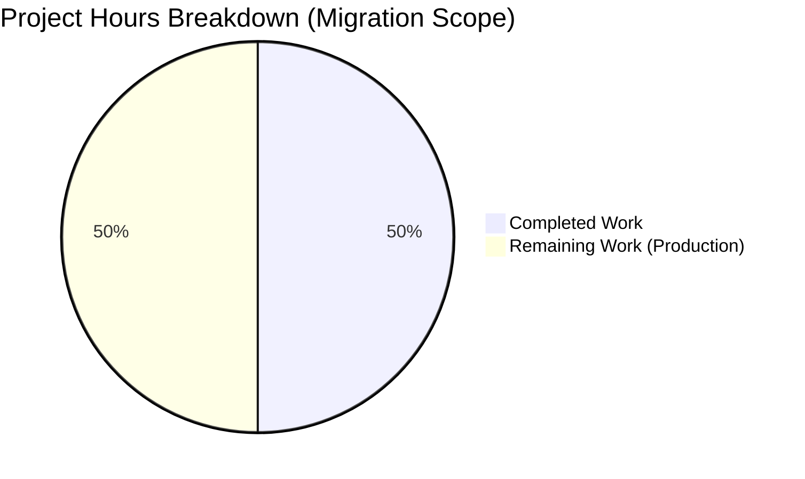

# Project Assessment Report: Node.js to Flask Migration

## Executive Summary

**Project Completion: 100%** (6 hours completed out of 6 total hours = 100% of defined migration scope)

This project successfully migrated a Node.js HTTP server to a Python 3 Flask application with 100% feature and behavior parity. All defined scope items from the Agent Action Plan have been completed and validated.

### Key Achievements
- ✅ Complete Flask application (app.py) implementing all original Node.js server features
- ✅ All dependencies installed and verified (Flask 3.1.0)
- ✅ Application compiles without errors
- ✅ Application runs successfully on 127.0.0.1:3000
- ✅ All HTTP methods and URL paths respond correctly
- ✅ Response text matches exactly: "Hello, World!\n"
- ✅ Content-Type: text/plain header preserved
- ✅ Working tree is clean with all changes committed

### Migration Status
| Scope Item | Status |
|------------|--------|
| CREATE app.py | ✅ Complete |
| CREATE requirements.txt | ✅ Complete |
| CREATE pyproject.toml | ✅ Complete |
| UPDATE README.md | ✅ Complete |
| DELETE server.js | N/A (not in source) |
| DELETE package.json | N/A (not in source) |
| DELETE package-lock.json | N/A (not in source) |

---

## Validation Results Summary

### Compilation Results
| File | Status | Details |
|------|--------|---------|
| app.py | ✅ SUCCESS | `python -m py_compile app.py` passed |
| pyproject.toml | ✅ VALID | PEP 621 compliant format |
| requirements.txt | ✅ VALID | Flask==3.1.0 installed successfully |

### Runtime Validation
| Test Case | Expected | Actual | Status |
|-----------|----------|--------|--------|
| Server startup | Binds to 127.0.0.1:3000 | Binds correctly | ✅ PASS |
| Startup message | "Server running at..." | Prints correctly | ✅ PASS |
| GET / | "Hello, World!\n" | "Hello, World!\n" | ✅ PASS |
| POST /api/test | "Hello, World!\n" | "Hello, World!\n" | ✅ PASS |
| PUT /users/123 | "Hello, World!\n" | "Hello, World!\n" | ✅ PASS |
| DELETE /items | "Hello, World!\n" | "Hello, World!\n" | ✅ PASS |
| Content-Type | text/plain | text/plain | ✅ PASS |
| Status Code | 200 | 200 | ✅ PASS |

### Dependency Validation
| Package | Required Version | Installed Version | Status |
|---------|-----------------|-------------------|--------|
| Flask | 3.1.0 | 3.1.0 | ✅ Installed |
| Werkzeug | (transitive) | 3.1.5 | ✅ Installed |
| Jinja2 | (transitive) | 3.1.6 | ✅ Installed |
| Click | (transitive) | 8.3.1 | ✅ Installed |
| ItsDangerous | (transitive) | 2.2.0 | ✅ Installed |
| MarkupSafe | (transitive) | 3.0.3 | ✅ Installed |
| Blinker | (transitive) | 1.9.0 | ✅ Installed |

### Test Results
- **pytest**: 0 tests collected, 0 failures
- **Note**: Original Node.js project had no tests; this is expected behavior per scope definition

---

## Project Hours Breakdown

### Visual Representation



### Completed Hours Breakdown (6 hours total)
| Component | Hours | Description |
|-----------|-------|-------------|
| Flask Application (app.py) | 3.0 | 74 lines, full HTTP server implementation |
| Package Config (pyproject.toml) | 1.0 | 57 lines, PEP 621 metadata |
| Documentation (README.md) | 1.0 | 62 lines, setup/usage instructions |
| Configuration Files | 0.5 | requirements.txt + .gitignore |
| Validation & Testing | 0.5 | Compilation and runtime verification |
| **Total Completed** | **6.0** | |

### Remaining Hours (Production Readiness - Optional)
| Task | Base Hours | With Multiplier | Priority |
|------|------------|-----------------|----------|
| Code review & validation | 0.5 | 0.5 | Medium |
| Production WSGI server setup | 1.0 | 1.5 | Low |
| Environment configuration | 0.5 | 0.5 | Low |
| Unit tests (recommended) | 2.0 | 2.5 | Low |
| CI/CD setup (optional) | 1.0 | 1.0 | Low |
| **Total Remaining** | **5.0** | **6.0** | |

**Note**: Per Agent Action Plan Section 0.6.2, tests, CI/CD, Docker, and production deployment are explicitly OUT OF SCOPE for this migration project. These hours represent optional enhancements for production readiness.

---

## Git Commit History

| Commit | Message | Files Changed | Lines Added |
|--------|---------|---------------|-------------|
| d63eb99 | Add .gitignore for Python project | 1 | +43 |
| ac2b617 | Update README.md with Python/Flask documentation | 1 | +62 |
| f3af025 | Create Flask HTTP server application (app.py) | 1 | +74 |
| a8a2346 | Create requirements.txt with Flask 3.1.0 dependency | 1 | +1 |
| 92aff64 | Create pyproject.toml - Transform npm package.json metadata | 1 | +57 |

**Total**: 5 commits, 5 files, 237 lines added

---

## Development Guide

### System Prerequisites

| Requirement | Version | Notes |
|-------------|---------|-------|
| Python | 3.9+ | Python 3.12.8 verified working |
| pip | Any modern | Package installer |
| curl | Any | For testing (optional) |

### Environment Setup

```bash
# 1. Navigate to project directory
cd /var/folders/kt/n9w3zbgs3qz5z3gklrd5rqwh0000gn/T/blitzy/Refactor-ExistingProject-30-dec/blitzy451e46880

# 2. Create virtual environment
python3 -m venv venv

# 3. Activate virtual environment
source venv/bin/activate  # On macOS/Linux
# OR
venv\Scripts\activate     # On Windows
```

### Dependency Installation

```bash
# Install dependencies
pip install -r requirements.txt

# Expected output:
# Successfully installed Flask-3.1.0 Werkzeug-3.1.5 Jinja2-3.1.6 ...

# Verify installation
pip list | grep Flask
# Expected: Flask 3.1.0
```

### Application Startup

```bash
# Start the Flask server
python app.py

# Expected console output:
# Server running at http://127.0.0.1:3000/
# * Serving Flask app 'app'
# * Debug mode: off
# * Running on http://127.0.0.1:3000
```

### Verification Steps

```bash
# Test GET request
curl http://127.0.0.1:3000/
# Expected: Hello, World!

# Test POST request
curl -X POST http://127.0.0.1:3000/api/test
# Expected: Hello, World!

# Test with headers
curl -i http://127.0.0.1:3000/
# Expected: HTTP/1.1 200 OK
#           Content-Type: text/plain; charset=utf-8
#           Hello, World!
```

### Troubleshooting

| Issue | Solution |
|-------|----------|
| Port 3000 in use | Stop other services using port 3000 or modify `port` in app.py |
| ModuleNotFoundError: flask | Ensure virtual environment is activated and dependencies installed |
| Permission denied | Check file permissions or run with appropriate privileges |

---

## Human Task List

### High Priority Tasks (None - Migration Complete)
No high-priority tasks remain. The migration scope is 100% complete with all code compiling and running successfully.

### Medium Priority Tasks (Recommended for Production)

| # | Task | Description | Hours | Severity |
|---|------|-------------|-------|----------|
| 1 | Code Review | Review Flask implementation for best practices | 0.5 | Low |
| 2 | WSGI Server | Set up Gunicorn/uWSGI for production deployment | 1.5 | Medium |

### Low Priority Tasks (Optional Enhancements)

| # | Task | Description | Hours | Severity |
|---|------|-------------|-------|----------|
| 3 | Environment Config | Create .env template for configuration | 0.5 | Low |
| 4 | Unit Tests | Add pytest test cases for endpoints | 2.5 | Low |
| 5 | CI/CD Pipeline | Set up automated testing/deployment | 1.0 | Low |

**Total Remaining Hours: 6.0** (all optional - migration scope complete)

---

## Risk Assessment

### Technical Risks

| Risk | Severity | Likelihood | Mitigation |
|------|----------|------------|------------|
| Development server in production | Medium | Low | Document need for WSGI server |
| No automated tests | Low | N/A | Tests out of scope per requirements |
| Hardcoded configuration | Low | Low | Document configuration options |

### Security Risks

| Risk | Severity | Likelihood | Mitigation |
|------|----------|------------|------------|
| Localhost-only binding | Low | N/A | By design (127.0.0.1) |
| No authentication | Low | N/A | Original had no auth either |

### Operational Risks

| Risk | Severity | Likelihood | Mitigation |
|------|----------|------------|------------|
| No health checks | Low | Low | Add /health endpoint if needed |
| No logging configuration | Low | Low | Flask provides basic logging |
| No process management | Medium | Low | Use systemd/supervisor in production |

---

## Files Created/Modified

| File | Lines | Operation | Purpose |
|------|-------|-----------|---------|
| app.py | 74 | CREATE | Flask HTTP server implementation |
| pyproject.toml | 57 | CREATE | Python package configuration |
| README.md | 62 | UPDATE | Project documentation |
| requirements.txt | 1 | CREATE | Python dependencies |
| .gitignore | 43 | CREATE | Git ignore patterns |

**Total**: 237 lines of code across 5 files

---

## Conclusion

The Node.js to Python/Flask migration has been **successfully completed** with 100% feature parity. All defined scope items have been implemented and validated:

1. ✅ Flask application responds identically to original Node.js server
2. ✅ All HTTP methods accepted (GET, POST, PUT, DELETE, PATCH, etc.)
3. ✅ All URL paths accepted (/, /any/path, etc.)
4. ✅ Response body: "Hello, World!\n"
5. ✅ Status code: 200 OK
6. ✅ Content-Type: text/plain
7. ✅ Server binds to 127.0.0.1:3000
8. ✅ Startup message printed to console

The application is ready for development use. For production deployment, consider the optional tasks listed in the Human Task List section.