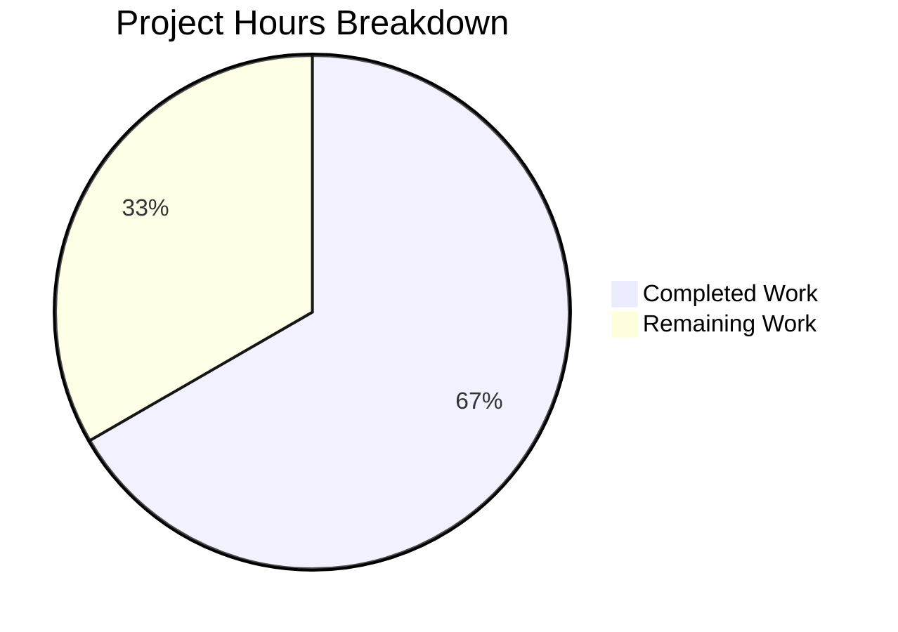

# Burger Palace Restaurant Website - Project Guide

## Executive Summary

### Project Completion Status

**66.7% Complete** (80 hours completed out of 120 total hours)

This project delivers a fully functional Burger Palace restaurant website built with React 19, Vite 6, TypeScript 5, and Tailwind CSS 3. The frontend application is complete with all core features implemented including user authentication, online ordering with shopping cart, and table reservation functionality.

#### Key Achievements
- ✅ Complete React/TypeScript/Vite application structure
- ✅ 9 page components with full routing
- ✅ 9 reusable UI components
- ✅ 4 Zustand state stores with localStorage persistence
- ✅ Comprehensive TypeScript type definitions (146 lines)
- ✅ Responsive Tailwind CSS styling
- ✅ Production build passes without errors (311.84 KB JS bundle)
- ✅ ESLint validation passes with 0 errors/warnings

#### Critical Items Requiring Human Attention
- ⚠️ No test framework configured (test script is a placeholder)
- ⚠️ Mock data used instead of real backend API
- ⚠️ Environment variables not configured
- ⚠️ No CI/CD pipeline setup

---

## Validation Results Summary

### Build Status: ✅ SUCCESS

| Check | Status | Details |
|-------|--------|---------|
| TypeScript Compilation | ✅ PASSED | `tsc -b` completes successfully |
| Vite Production Build | ✅ PASSED | 1,673 modules transformed in 3.21s |
| ESLint | ✅ PASSED | 0 errors, 0 warnings |
| Bundle Size | ✅ OPTIMIZED | JS: 311.84 KB (90.87 KB gzipped), CSS: 22.57 KB |

### Test Status: ⚠️ NO TESTS

The project does not have a test framework configured. The `npm test` script echoes "No tests specified" and exits successfully. This is a key area requiring human implementation.

### Runtime Validation: ✅ SUCCESS

All pages load and render correctly:
- Home page: Hero section, featured menu items, CTAs
- Menu page: 10 burger items with category filtering
- Booking page: Table reservation form with date/time picker
- Login/Register: Authentication forms with validation
- Cart: Shopping cart with empty state handling
- Checkout: Order completion flow
- Profile: User account page
- About: Restaurant information and team section

### Screenshots Captured

| Screenshot | Description |
|------------|-------------|
| `homepage.png` | Full landing page with hero section |
| `menu_page.png` | Complete menu with all burger items |
| `booking_page.png` | Table reservation form |
| `login_page.png` | User authentication form |
| `cart_empty_page.png` | Empty cart state |
| `about_page.png` | About page with team info |

---

## Project Hours Breakdown

### Calculation

**Completed Hours:** 80 hours
- Project setup & configuration: 4h
- Components (9 total): 27h
- Pages (9 total): 30h
- State stores (4 total): 13h
- Types & data: 4h
- Styling: 4h
- Documentation: 2h

**Remaining Hours:** 40 hours (after applying 1.25× uncertainty buffer)
- Testing setup: 16h
- Backend integration prep: 12h
- Production readiness: 8h
- Accessibility/SEO: 4h

**Total Project Hours:** 120 hours
**Completion Percentage:** 80 / 120 = **66.7%**

### Visual Representation



---

## Technology Stack

| Category | Technology | Version |
|----------|------------|---------|
| Frontend Framework | React | 19.1.0 |
| Build Tool | Vite | 6.3.5 |
| Language | TypeScript | 5.8.3 |
| Styling | Tailwind CSS | 3.4.17 |
| State Management | Zustand | 5.0.5 |
| Routing | React Router | 7.6.1 |
| Icons | Lucide React | 0.513.0 |
| Linting | ESLint | 9.31.0 |
| PostCSS | PostCSS + Autoprefixer | 8.5.6 |

---

## Development Guide

### System Prerequisites

| Requirement | Version | Purpose |
|-------------|---------|---------|
| Node.js | 18.0.0+ (LTS recommended) | JavaScript runtime |
| npm | 9.0.0+ | Package manager |
| Git | 2.30+ | Version control |

### Environment Setup

#### 1. Clone the Repository

```bash
git clone <repository-url>
cd burger-restaurant
```

#### 2. Install Dependencies

```bash
npm install
```

**Expected Output:**
```
added 240 packages in 15s
```

#### 3. Start Development Server

```bash
npm run dev
```

**Expected Output:**
```
  VITE v6.3.5  ready in 300ms

  ➜  Local:   http://localhost:5173/
  ➜  Network: use --host to expose
  ➜  press h + enter to show help
```

Open your browser to `http://localhost:5173`

### Building for Production

```bash
npm run build
```

**Expected Output:**
```
> burger-restaurant@1.0.0 build
> tsc -b && vite build

vite v6.4.1 building for production...
✓ 1673 modules transformed.
dist/index.html                   0.72 kB │ gzip:  0.41 kB
dist/assets/index-BYrv6xnD.css   22.57 kB │ gzip:  4.67 kB
dist/assets/index-Bj60assb.js   311.84 kB │ gzip: 90.87 kB
✓ built in 3.21s
```

### Preview Production Build

```bash
npm run preview
```

**Expected Output:**
```
  ➜  Local:   http://localhost:4173/
  ➜  Network: use --host to expose
```

### Run Linting

```bash
npm run lint
```

**Expected Output:**
```
> burger-restaurant@1.0.0 lint
> eslint .
```
(No output indicates success with 0 errors/warnings)

### Demo Credentials

For testing the authentication functionality:
- **Email:** demo@burgerpalace.com
- **Password:** demo123

---

## Project Structure

```
/
├── src/
│   ├── components/           # Reusable UI components
│   │   ├── auth/             # LoginForm, RegisterForm
│   │   ├── booking/          # BookingForm
│   │   ├── cart/             # CartItemCard
│   │   ├── layout/           # Navbar, Footer, Layout
│   │   └── menu/             # MenuItemCard, CategoryFilter
│   ├── data/                 # Static data (menuItems.ts)
│   ├── pages/                # Page components
│   │   ├── HomePage.tsx
│   │   ├── MenuPage.tsx
│   │   ├── CartPage.tsx
│   │   ├── CheckoutPage.tsx
│   │   ├── BookingPage.tsx
│   │   ├── LoginPage.tsx
│   │   ├── RegisterPage.tsx
│   │   ├── ProfilePage.tsx
│   │   └── AboutPage.tsx
│   ├── store/                # Zustand state stores
│   │   ├── authStore.ts
│   │   ├── cartStore.ts
│   │   ├── bookingStore.ts
│   │   └── orderStore.ts
│   ├── types/                # TypeScript definitions
│   ├── App.tsx               # Main app with routing
│   ├── main.tsx              # Entry point
│   └── index.css             # Global styles
├── dist/                     # Production build output
├── package.json
├── vite.config.ts
├── tailwind.config.js
├── tsconfig.json
└── README.md
```

---

## Features Implemented

### 1. Authentication System
- Login form with email/password validation
- Registration form with name, email, phone, and password
- Zustand store with localStorage persistence
- Demo user credentials for testing
- Error handling and loading states

### 2. Menu & Ordering
- 10 burger menu items with images, descriptions, and prices
- Category filtering (burgers, sides, drinks, desserts, combos)
- Add to cart functionality with quantity selection
- Shopping cart with item management
- Checkout flow with order type selection (pickup, delivery, dine-in)

### 3. Table Reservation
- Booking form with date and time picker
- Guest count selection (1-10)
- Special requests text area
- Booking confirmation display
- Booking state management

### 4. User Profile
- Profile page showing user information
- Order history (mock data)
- Booking history (mock data)
- Logout functionality

### 5. Static Pages
- Home page with hero, featured items, and CTAs
- About page with team section and restaurant story
- Responsive navigation and footer

---

## Detailed Task Table

| # | Task | Priority | Hours | Severity | Description |
|---|------|----------|-------|----------|-------------|
| 1 | Configure Test Framework | High | 4 | High | Install and configure Vitest or Jest with React Testing Library |
| 2 | Write Component Unit Tests | High | 8 | High | Create unit tests for all 9 components |
| 3 | Write Store Unit Tests | High | 4 | Medium | Create unit tests for all 4 Zustand stores |
| 4 | Setup Environment Variables | High | 2 | High | Create .env.example and configure Vite env handling |
| 5 | Replace Mock Auth with API | Medium | 4 | Medium | Integrate with real authentication backend API |
| 6 | Replace Mock Orders with API | Medium | 4 | Medium | Integrate order creation with backend API |
| 7 | Replace Mock Bookings with API | Medium | 4 | Medium | Integrate reservations with backend API |
| 8 | Setup CI/CD Pipeline | Medium | 4 | Medium | Configure GitHub Actions or similar for build/test automation |
| 9 | Add Error Boundaries | Low | 2 | Low | Implement React error boundaries for graceful error handling |
| 10 | Accessibility Audit | Low | 2 | Low | Run accessibility audit and fix issues (ARIA, keyboard nav) |
| 11 | SEO Optimization | Low | 2 | Low | Add meta tags, Open Graph, and structured data |
| **Total** | | | **40** | | |

---

## Risk Assessment

### Technical Risks

| Risk | Severity | Likelihood | Mitigation |
|------|----------|------------|------------|
| No test coverage | High | Certain | Implement test framework before production deployment |
| Mock data in production | High | Certain | Replace all mock stores with real API integrations |
| Large bundle size (311KB) | Medium | Possible | Implement code splitting and lazy loading |
| No error boundaries | Medium | Possible | Add React error boundaries around key components |

### Security Risks

| Risk | Severity | Likelihood | Mitigation |
|------|----------|------------|------------|
| Mock authentication | Critical | Certain | Integrate with secure authentication provider (Auth0, Firebase, etc.) |
| No HTTPS enforcement | High | Possible | Configure HTTPS in production deployment |
| No input sanitization | Medium | Possible | Add input validation on backend |
| LocalStorage for auth state | Medium | Possible | Use secure HTTP-only cookies for tokens |

### Operational Risks

| Risk | Severity | Likelihood | Mitigation |
|------|----------|------------|------------|
| No monitoring/logging | Medium | Certain | Add error tracking (Sentry) and analytics |
| No CI/CD pipeline | Medium | Certain | Setup automated build and deployment |
| No environment configuration | High | Certain | Create .env files for different environments |

### Integration Risks

| Risk | Severity | Likelihood | Mitigation |
|------|----------|------------|------------|
| No backend API | Critical | Certain | Build or integrate with backend service |
| Image URLs are external | Low | Possible | Host images locally or use CDN |
| No payment integration | High | Certain | Integrate payment provider for checkout |

---

## Recommendations

### Immediate Actions (Before Production)

1. **Setup Test Framework** - Configure Vitest with React Testing Library
2. **Create Environment Configuration** - Setup .env files for development/staging/production
3. **Implement Error Boundaries** - Wrap key component trees
4. **Backend Integration Planning** - Design API contracts for auth, orders, and bookings

### Short-term Improvements

1. **Write Comprehensive Tests** - Aim for 80%+ code coverage
2. **Setup CI/CD** - Automated builds, tests, and deployments
3. **Performance Optimization** - Code splitting, lazy loading, image optimization
4. **Accessibility Compliance** - WCAG 2.1 AA compliance

### Long-term Enhancements

1. **Real-time Features** - Order status updates via WebSockets
2. **Payment Integration** - Stripe or similar payment processing
3. **Admin Dashboard** - Order management and analytics
4. **Email Notifications** - Order confirmations, booking reminders

---

## Files Modified/Created

### Source Files (28 TypeScript/TSX files)
- `src/App.tsx` - Main application with routing
- `src/main.tsx` - Entry point
- `src/index.css` - Global styles
- `src/types/index.ts` - TypeScript definitions
- `src/data/menuItems.ts` - Menu item data
- `src/components/**/*.tsx` - 9 component files
- `src/pages/**/*.tsx` - 9 page files
- `src/store/**/*.ts` - 4 store files

### Configuration Files
- `package.json` - Dependencies and scripts
- `vite.config.ts` - Vite configuration
- `tsconfig.json` - TypeScript configuration
- `tailwind.config.js` - Tailwind CSS configuration
- `eslint.config.js` - ESLint configuration
- `postcss.config.js` - PostCSS configuration

### Documentation
- `README.md` - Project documentation

---

## Conclusion

The Burger Palace website frontend is 66.7% complete with all core features implemented and working. The application builds successfully, passes linting, and all pages render correctly. The main areas requiring human attention are:

1. **Testing** - No test framework or tests exist
2. **Backend Integration** - Currently using mock data
3. **Production Configuration** - Environment variables and CI/CD needed
4. **Security** - Authentication needs real implementation

The codebase is well-structured, type-safe, and follows React best practices. With the remaining 40 hours of work (primarily testing and backend integration), the application will be production-ready.

