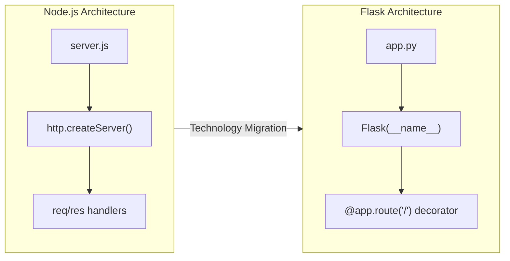
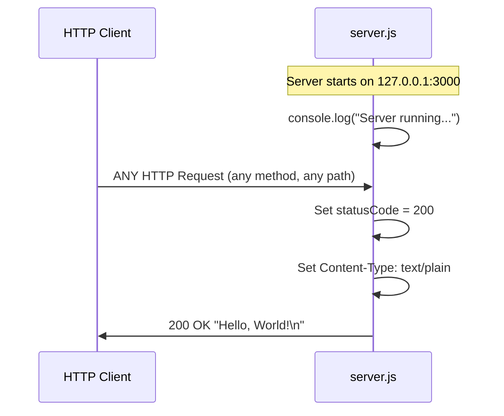
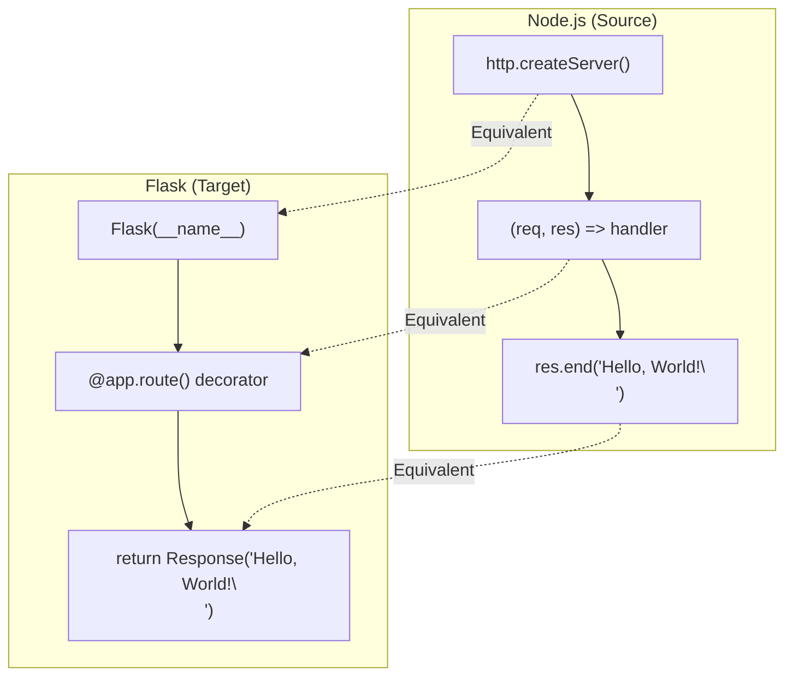
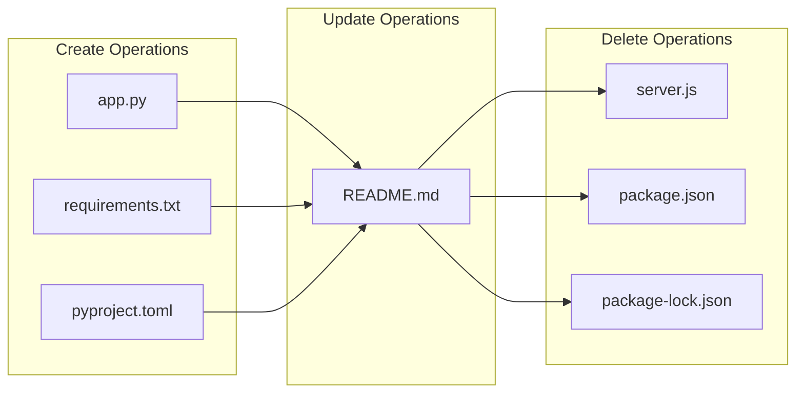
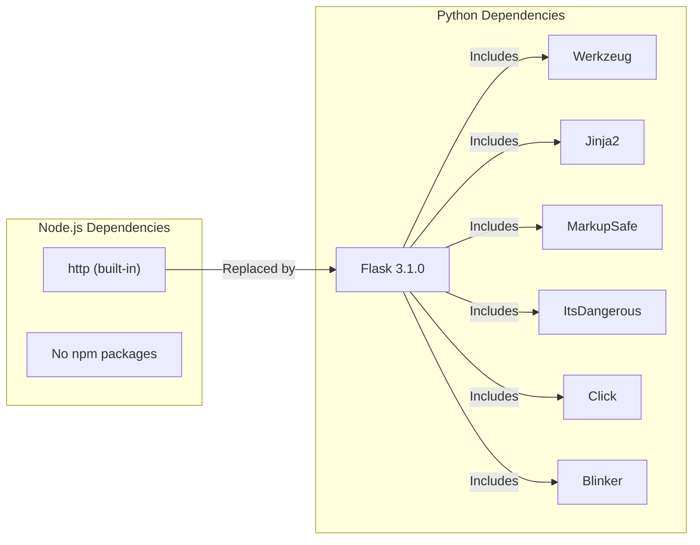

# Technical Specification

# 0. Agent Action Plan

## 0.1 Intent Clarification

### 0.1.1 Core Refactoring Objective

Based on the prompt, the Blitzy platform understands that the refactoring objective is to **completely rewrite an existing Node.js HTTP server into a Python 3 Flask application**, while preserving every feature and functionality exactly as implemented in the original Node.js project. The rewritten version must fully match the behavior and logic of the current implementation.

**Refactoring Classification:**

| Attribute | Value |
|-----------|-------|
| Refactoring Type | Tech Stack Migration (Node.js → Python/Flask) |
| Target Repository | Same repository transformation |
| Preservation Requirement | 100% feature and behavior parity |
| Complexity Level | Low (minimal codebase, single-purpose server) |

**Specific Refactoring Goals:**

- **Language Migration**: Convert JavaScript/Node.js code to Python 3 syntax
- **Framework Adoption**: Replace Node.js built-in `http` module with Flask web framework
- **Behavior Preservation**: Maintain identical HTTP response characteristics (status code, headers, body content)
- **Configuration Parity**: Preserve host binding (`127.0.0.1`) and port configuration (`3000`)
- **Package Metadata Update**: Transform npm package manifest to Python package structure
- **Documentation Continuity**: Update README to reflect new Python/Flask stack

**Implicit Requirements Identified:**

- Maintain the "Hello, World!" response text exactly as `Hello, World!\n`
- Preserve HTTP status code `200` for all responses
- Maintain `Content-Type: text/plain` header
- Keep server accessible only on localhost interface
- Ensure startup message logs to console with equivalent information
- Remove all Node.js/npm artifacts and replace with Python equivalents

### 0.1.2 Special Instructions and Constraints

**User-Specified Directive (Verbatim):**
> "Rewrite this Node.js server into a Python 3 Flask application, keeping every feature and functionality exactly as in the original Node.js project. Ensure the rewritten version fully matches the behavior and logic of the current implementation."

**Extracted Constraints:**

| Constraint Category | Specific Requirement |
|---------------------|---------------------|
| Framework Selection | Flask (explicitly specified) |
| Python Version | Python 3 (explicitly specified) |
| Behavior Matching | Exact feature parity required |
| Logic Preservation | All original logic must be replicated |
| Functionality Coverage | Every feature must be preserved |

**Migration Requirements:**

- Replace Node.js runtime with Python 3 runtime
- Replace npm package management with pip/requirements.txt
- Replace CommonJS module system with Python module imports
- Replace `http.createServer` with Flask application factory pattern
- Ensure Flask development server binds to same host and port

**No Additional Special Instructions Were Provided For:**

- Test coverage requirements
- Performance benchmarks
- Deployment configuration
- CI/CD pipeline updates

### 0.1.3 Technical Interpretation

This refactoring translates to the following technical transformation strategy:

**Architecture Mapping:**



**Transformation Rules:**

| Node.js Construct | Flask Equivalent | Transformation Pattern |
|-------------------|------------------|----------------------|
| `const http = require('http')` | `from flask import Flask` | Module import replacement |
| `http.createServer(callback)` | `app = Flask(__name__)` | Server instantiation |
| `(req, res) => { ... }` | `@app.route('/')` decorator | Route handler pattern |
| `res.statusCode = 200` | Implicit (200 is Flask default) | Default behavior |
| `res.setHeader('Content-Type', 'text/plain')` | `Response(..., mimetype='text/plain')` | Header configuration |
| `res.end('Hello, World!\n')` | `return 'Hello, World!\n'` | Response body return |
| `server.listen(port, hostname, callback)` | `app.run(host, port)` | Server startup |
| `console.log(...)` | `print(...)` or Flask logger | Console output |
| `package.json` | `requirements.txt` + `pyproject.toml` | Package manifest |
| `package-lock.json` | N/A (removed) | Lock file elimination |

**Behavioral Equivalence Requirements:**

| Behavior | Node.js Implementation | Flask Implementation |
|----------|----------------------|---------------------|
| Default Route | Responds to all paths | Route matching all paths with `@app.route('/', defaults={'path': ''})` and `@app.route('/<path:path>')` |
| HTTP Methods | Accepts all methods | Add `methods` parameter to accept all HTTP methods |
| Response Body | `Hello, World!\n` | Identical string return |
| Status Code | `200` | Implicit default `200` |
| Content Type | `text/plain` | Explicit `mimetype` parameter |
| Server Host | `127.0.0.1` | `host='127.0.0.1'` |
| Server Port | `3000` | `port=3000` |
| Startup Message | `Server running at http://...` | Equivalent print statement |


## 0.2 Source Analysis

### 0.2.1 Comprehensive Source File Discovery

**Search Patterns Applied:**

The following search patterns were used to identify ALL files requiring transformation based on the user's migration instructions:

| Pattern | Purpose | Files Matched |
|---------|---------|---------------|
| `*.js` | JavaScript source files | `server.js` |
| `package.json` | npm package manifest | `package.json` |
| `package-lock.json` | npm dependency lock | `package-lock.json` |
| `README.md` | Documentation | `README.md` |
| `.git/` | Version control (excluded) | N/A |

**Complete File Inventory:**

| File | Size | Lines | Purpose | Action Required |
|------|------|-------|---------|-----------------|
| `server.js` | 342 bytes | 15 lines | Core HTTP server implementation | Rewrite to Flask |
| `package.json` | 251 bytes | 11 lines | npm package manifest with metadata | Replace with Python package files |
| `package-lock.json` | 247 bytes | 1 entry | npm dependency lock (empty deps) | Remove entirely |
| `README.md` | 73 bytes | 2 lines | Project documentation | Update for Flask stack |

### 0.2.2 Current Structure Mapping

**Repository File Tree (Complete):**

```
Current Source Structure:
/
├── .git/                    (version control - excluded from migration)
├── README.md                (documentation - to be updated)
├── package.json             (npm manifest - to be replaced)
├── package-lock.json        (npm lock - to be removed)
└── server.js                (HTTP server - to be rewritten)
```

**Source Code Analysis - server.js:**

```javascript
// Line-by-line analysis of server.js
const http = require('http');           // Line 1: Import Node.js built-in http module
                                        // Line 2: (empty)
const hostname = '127.0.0.1';           // Line 3: Server hostname constant
const port = 3000;                      // Line 4: Server port constant
                                        // Line 5: (empty)
const server = http.createServer((req, res) => {  // Line 6: Create server with handler
  res.statusCode = 200;                 // Line 7: Set HTTP status to 200 OK
  res.setHeader('Content-Type', 'text/plain');    // Line 8: Set response content type
  res.end('Hello, World!\n');           // Line 9: Send response body and close
});                                     // Line 10: End handler
                                        // Line 11: (empty)
server.listen(port, hostname, () => {   // Line 12: Start listening on host:port
  console.log(`Server running at http://${hostname}:${port}/`);  // Line 13: Log startup
});                                     // Line 14: End listen callback
                                        // Line 15: (empty)
```

**Source Code Analysis - package.json:**

| Field | Value | Migration Action |
|-------|-------|-----------------|
| `name` | `hello_world` | Preserve in Python package name |
| `version` | `1.0.0` | Preserve in Python package version |
| `description` | `Hello world in Node.js` | Update to reflect Python/Flask |
| `main` | `index.js` | Replace with Python entry point |
| `scripts.test` | placeholder (exits 1) | Replace with Python test command |
| `author` | `hxu` | Preserve in Python package metadata |
| `license` | `MIT` | Preserve in Python package metadata |

**Dependencies Identified:**

| Dependency Type | Package | Version | Status |
|----------------|---------|---------|--------|
| Runtime | Node.js built-in `http` | N/A | Core module, no external dep |
| External npm | None | N/A | Zero external dependencies |

### 0.2.3 Source Behavior Specification

**HTTP Server Behavioral Contract:**

| Aspect | Specification | Evidence Location |
|--------|---------------|-------------------|
| Binding Interface | Localhost only (`127.0.0.1`) | `server.js` line 3 |
| Port Number | `3000` | `server.js` line 4 |
| HTTP Methods Accepted | ALL (GET, POST, PUT, DELETE, etc.) | No method filtering in handler |
| URL Paths Accepted | ALL (`/`, `/foo`, `/any/path`) | No path filtering in handler |
| Response Status | Always `200 OK` | `server.js` line 7 |
| Response Headers | `Content-Type: text/plain` | `server.js` line 8 |
| Response Body | `Hello, World!\n` (with newline) | `server.js` line 9 |
| Startup Output | `Server running at http://127.0.0.1:3000/` | `server.js` line 13 |

**Request/Response Flow:**



### 0.2.4 Complete Source File Listing

**CRITICAL: All source files have been identified. No files are pending discovery.**

| # | File Path | Type | Lines | Status |
|---|-----------|------|-------|--------|
| 1 | `server.js` | JavaScript | 15 | To be rewritten |
| 2 | `package.json` | JSON | 11 | To be replaced |
| 3 | `package-lock.json` | JSON | 14 | To be removed |
| 4 | `README.md` | Markdown | 2 | To be updated |

**Total Files for Migration: 4**
**Files to Create New: 3** (app.py, requirements.txt, pyproject.toml)
**Files to Remove: 3** (server.js, package.json, package-lock.json)
**Files to Update: 1** (README.md)


## 0.3 Target Design

### 0.3.1 Refactored Structure Planning

**Target Architecture - Complete File Tree:**

```
Target Flask Structure:
/
├── .git/                    (preserved - version control)
├── README.md                (updated - Flask documentation)
├── requirements.txt         (created - Python dependencies)
├── pyproject.toml           (created - Python package metadata)
└── app.py                   (created - Flask HTTP server)
```

**Detailed Target File Specification:**

| File | Purpose | Content Summary |
|------|---------|-----------------|
| `app.py` | Flask application entry point | Main server implementation with route handlers |
| `requirements.txt` | Python dependency manifest | Flask and its dependencies |
| `pyproject.toml` | Python package configuration | Project metadata (name, version, author, license) |
| `README.md` | Project documentation | Updated instructions for Python/Flask setup |

### 0.3.2 Target File Content Design

**app.py Design Specification:**

```python
# Target structure (conceptual)
from flask import Flask, Response

app = Flask(__name__)
hostname = '127.0.0.1'
port = 3000

@app.route('/', defaults={'path': ''}, methods=['GET', 'POST', ...])
@app.route('/<path:path>', methods=['GET', 'POST', ...])
def hello_world(path):
    return Response('Hello, World!\n', mimetype='text/plain')

if __name__ == '__main__':
    print(f'Server running at http://{hostname}:{port}/')
    app.run(host=hostname, port=port)
```

**requirements.txt Design:**

| Package | Version | Purpose |
|---------|---------|---------|
| Flask | 3.1.0 | Web framework for HTTP server |

**pyproject.toml Design:**

| Section | Field | Value |
|---------|-------|-------|
| `[project]` | `name` | `hello_world` |
| `[project]` | `version` | `1.0.0` |
| `[project]` | `description` | `Hello world in Python/Flask` |
| `[project]` | `authors` | `[{name = "hxu"}]` |
| `[project]` | `license` | `{text = "MIT"}` |
| `[project]` | `requires-python` | `>=3.9` |
| `[project]` | `dependencies` | `["flask>=3.1.0"]` |

### 0.3.3 Web Search Research Conducted

**Research Topics Investigated:**

| Topic | Key Findings | Application |
|-------|--------------|-------------|
| Flask Best Practices 2024 | Recommended project structure with separate routes and config files; however, minimal structure appropriate for simple servers | Keep single-file structure to match source simplicity |
| Flask Latest Version | Flask 3.1.x is current stable (3.1.0 released Nov 2024), supports Python 3.9+ | Use Flask 3.1.0 in requirements.txt |
| Flask HTTP Server Migration | Flask's built-in development server suitable for development/testing; use `app.run()` for equivalent behavior | Match Node.js development server pattern |
| Flask Route Matching | Use `defaults` parameter and `<path:path>` converter for catch-all routes | Implement to match Node.js "accept all paths" behavior |

**Framework Selection Justification:**

| Criterion | Flask Assessment | Suitability |
|-----------|------------------|-------------|
| Explicit User Requirement | User specified Flask | ✅ Mandatory |
| Minimalist Philosophy | Lightweight, no bloat | ✅ Matches source simplicity |
| Built-in Dev Server | `app.run()` provides development server | ✅ Direct equivalent |
| Learning Curve | Low - simple API | ✅ Maintainable |
| Python 3 Support | Full support for Python 3.9+ | ✅ Compatible |

### 0.3.4 Design Pattern Applications

**Patterns Applied:**

| Pattern | Application | Rationale |
|---------|-------------|-----------|
| Single Module Pattern | All code in `app.py` | Preserves source simplicity (single `server.js`) |
| Application Factory (Simplified) | Direct `Flask(__name__)` instantiation | No complex initialization needed |
| Catch-All Route Pattern | `@app.route('/<path:path>')` | Match Node.js behavior of accepting all paths |
| Configuration Constants | `hostname` and `port` as module constants | Mirror Node.js const declarations |

**Pattern NOT Applied (Intentionally):**

| Pattern | Reason for Exclusion |
|---------|---------------------|
| Blueprints | Over-engineering for single-route server |
| Application Factory Pattern (Full) | Unnecessary complexity |
| Configuration Classes | Source uses hardcoded values |
| Separate Routes Module | Source has single file |
| Database Patterns | No database in source |
| Service Layer | No business logic beyond response |

### 0.3.5 Behavioral Parity Design

**Ensuring Exact Feature Match:**

| Node.js Feature | Flask Implementation | Verification Method |
|-----------------|---------------------|---------------------|
| Accepts all HTTP methods | `methods=['GET', 'HEAD', 'POST', 'PUT', 'DELETE', 'CONNECT', 'OPTIONS', 'TRACE', 'PATCH']` | Test with various methods |
| Accepts all URL paths | Dual route with defaults and path converter | Test with various paths |
| Returns `Hello, World!\n` | `return Response('Hello, World!\n', ...)` | String comparison |
| Returns status 200 | Flask default (implicit) | HTTP response inspection |
| Returns `text/plain` | `mimetype='text/plain'` | Header inspection |
| Binds to 127.0.0.1 | `host='127.0.0.1'` | Network binding check |
| Uses port 3000 | `port=3000` | Port verification |
| Logs startup message | `print(f'Server running at...')` | Console output |

**Request Handling Equivalence:**




## 0.4 Transformation Mapping

### 0.4.1 File-by-File Transformation Plan

**Complete Transformation Matrix:**

| Target File | Transformation | Source File | Key Changes |
|-------------|----------------|-------------|-------------|
| `app.py` | CREATE | `server.js` | Rewrite Node.js HTTP server to Flask application; convert `http.createServer()` to `Flask(__name__)`; convert callback handler to `@app.route()` decorated function; convert `res.end()` to `return Response()` |
| `requirements.txt` | CREATE | `package.json` | Extract dependency concept; add Flask 3.1.0 as sole dependency; no source file has dependencies but this is standard Python practice |
| `pyproject.toml` | CREATE | `package.json` | Transform npm package metadata to Python format; preserve name, version, author, license, description; update description text |
| `README.md` | UPDATE | `README.md` | Update project documentation to reflect Python/Flask technology stack; add Python setup and run instructions |
| `server.js` | DELETE | N/A | Remove original Node.js server file after `app.py` is created |
| `package.json` | DELETE | N/A | Remove npm package manifest after Python package files are created |
| `package-lock.json` | DELETE | N/A | Remove npm lock file entirely (no Python equivalent needed for this simple project) |

### 0.4.2 Detailed File Transformations

**Transformation #1: server.js → app.py**

| Source Line | Source Code | Target Code | Notes |
|-------------|-------------|-------------|-------|
| 1 | `const http = require('http');` | `from flask import Flask, Response` | Module import replacement |
| 3 | `const hostname = '127.0.0.1';` | `hostname = '127.0.0.1'` | Variable syntax change |
| 4 | `const port = 3000;` | `port = 3000` | Variable syntax change |
| 6-10 | `http.createServer((req, res) => {...})` | `app = Flask(__name__)` + `@app.route()` decorator | Complete pattern replacement |
| 7 | `res.statusCode = 200;` | (implicit - Flask default) | Not needed explicitly |
| 8 | `res.setHeader('Content-Type', 'text/plain');` | `mimetype='text/plain'` in Response | Header mechanism change |
| 9 | `res.end('Hello, World!\n');` | `return Response('Hello, World!\n', ...)` | Response return pattern |
| 12-14 | `server.listen(port, hostname, () => {...})` | `if __name__ == '__main__': app.run(...)` | Server startup pattern |
| 13 | `console.log(\`Server running at...\`)` | `print(f'Server running at...')` | Console output mechanism |

**Transformation #2: package.json → pyproject.toml**

| package.json Field | pyproject.toml Equivalent | Value Transformation |
|-------------------|--------------------------|---------------------|
| `"name": "hello_world"` | `name = "hello_world"` | Direct transfer |
| `"version": "1.0.0"` | `version = "1.0.0"` | Direct transfer |
| `"description": "Hello world in Node.js"` | `description = "Hello world in Python/Flask"` | Updated for new stack |
| `"main": "index.js"` | N/A | Not applicable in Python |
| `"scripts": {...}` | `[project.scripts]` (optional) | Could add `run` script |
| `"author": "hxu"` | `authors = [{name = "hxu"}]` | Format change |
| `"license": "MIT"` | `license = {text = "MIT"}` | Format change |

**Transformation #3: package.json → requirements.txt**

| Source Context | Target Content |
|----------------|----------------|
| Zero npm dependencies | `Flask==3.1.0` (explicit version pinning) |

**Transformation #4: README.md → README.md**

| Section | Original | Updated |
|---------|----------|---------|
| Title | `# hao-backprop-test` | `# hao-backprop-test` (preserved) |
| Description | `test project for backprop integration. Do not touch!` | Updated with Python/Flask context and run instructions |

### 0.4.3 Cross-File Dependencies

**Import Statement Updates:**

Since this is a complete technology stack migration (Node.js → Python), there are no cross-file import updates within the application code. The transformation creates a new, self-contained Python application.

**External Reference Considerations:**

| Reference Type | Impact | Action |
|----------------|--------|--------|
| No upstream importers | None | N/A |
| No downstream dependencies | None | N/A |
| No configuration files reference server.js | None | N/A |
| README references project | Update needed | Include Python instructions |

### 0.4.4 Wildcard Patterns

**Patterns for File Operations:**

| Pattern | Operation | Description |
|---------|-----------|-------------|
| `*.js` | DELETE | Remove all JavaScript source files |
| `package*.json` | DELETE | Remove npm package files |
| `app.py` | CREATE | Create Flask application |
| `requirements.txt` | CREATE | Create Python dependencies |
| `pyproject.toml` | CREATE | Create Python package config |
| `README.md` | UPDATE | Update documentation |

**Note:** Wildcard patterns are minimal because the source repository contains only 4 files total. Specific file targeting is more appropriate than wildcards for this migration.

### 0.4.5 One-Phase Execution Plan

**CRITICAL: The entire refactor will be executed by Blitzy in ONE phase.**

**Execution Order Within Single Phase:**

| Step | Action | File | Rationale |
|------|--------|------|-----------|
| 1 | CREATE | `app.py` | Create Flask server first |
| 2 | CREATE | `requirements.txt` | Define Python dependencies |
| 3 | CREATE | `pyproject.toml` | Define Python package metadata |
| 4 | UPDATE | `README.md` | Update documentation |
| 5 | DELETE | `server.js` | Remove original Node.js server |
| 6 | DELETE | `package.json` | Remove npm manifest |
| 7 | DELETE | `package-lock.json` | Remove npm lock file |

**Dependency Graph for Execution:**



### 0.4.6 Comprehensive Transformation Checklist

| # | Source File | Target File | Action | Status |
|---|-------------|-------------|--------|--------|
| 1 | `server.js` | `app.py` | CREATE (rewrite) | Planned |
| 2 | `package.json` | `pyproject.toml` | CREATE (transform) | Planned |
| 3 | `package.json` | `requirements.txt` | CREATE (new concept) | Planned |
| 4 | `README.md` | `README.md` | UPDATE | Planned |
| 5 | `server.js` | - | DELETE | Planned |
| 6 | `package.json` | - | DELETE | Planned |
| 7 | `package-lock.json` | - | DELETE | Planned |

**Total Operations: 7**
- CREATE: 3 files
- UPDATE: 1 file
- DELETE: 3 files


## 0.5 Dependency Inventory

### 0.5.1 Key Private and Public Packages

**Source Project Dependencies (Node.js):**

| Registry | Package Name | Version | Purpose | Status |
|----------|--------------|---------|---------|--------|
| Node.js Built-in | `http` | N/A (core) | HTTP server functionality | Core module, not external |
| npm | (none) | N/A | No external dependencies | N/A |

**Target Project Dependencies (Python/Flask):**

| Registry | Package Name | Version | Purpose | Required |
|----------|--------------|---------|---------|----------|
| PyPI | Flask | 3.1.0 | Web framework for HTTP server | Yes |
| PyPI (transitive) | Werkzeug | (auto) | WSGI utilities, installed with Flask | Auto |
| PyPI (transitive) | Jinja2 | (auto) | Template engine, installed with Flask | Auto |
| PyPI (transitive) | MarkupSafe | (auto) | Safe string handling, installed with Flask | Auto |
| PyPI (transitive) | ItsDangerous | (auto) | Secure data signing, installed with Flask | Auto |
| PyPI (transitive) | Click | (auto) | CLI utilities, installed with Flask | Auto |
| PyPI (transitive) | Blinker | (auto) | Signal support, installed with Flask | Auto |

**Version Justification:**

| Package | Specified Version | Justification |
|---------|------------------|---------------|
| Flask | 3.1.0 | Latest stable version as of December 2024; supports Python 3.9+; verified via PyPI |

**Note:** User did not specify Flask version. Version 3.1.0 is selected based on web research confirming it as the current stable release. This version was released November 13, 2024.

### 0.5.2 Dependency Updates

**Import Refactoring:**

Since this is a complete technology stack migration, imports are not updated but rather completely replaced:

| Source Import (Node.js) | Target Import (Python) |
|------------------------|----------------------|
| `const http = require('http');` | `from flask import Flask, Response` |

**No Internal Import Updates Required:**

The source project has only one source file (`server.js`) with no internal module dependencies. The target project will similarly have one source file (`app.py`) with no internal module dependencies.

### 0.5.3 External Reference Updates

**Configuration Files:**

| File Type | Source | Target | Changes |
|-----------|--------|--------|---------|
| Package manifest | `package.json` | `pyproject.toml` | Complete replacement |
| Lock file | `package-lock.json` | (none needed) | Removed entirely |
| Dependencies list | (in package.json, empty) | `requirements.txt` | New file with Flask |

**Documentation Updates:**

| File | Changes Required |
|------|-----------------|
| `README.md` | Update with Python/Flask setup instructions |

**Build/Run Files:**

| Node.js Command | Python/Flask Equivalent |
|-----------------|------------------------|
| `node server.js` | `python app.py` |
| `npm install` | `pip install -r requirements.txt` |
| `npm test` (placeholder) | `python -m pytest` (optional) |

### 0.5.4 Runtime Requirements

**Source Runtime (Node.js):**

| Component | Requirement | Evidence |
|-----------|-------------|----------|
| Runtime | Node.js (any version with CommonJS) | `require()` syntax |
| Package Manager | npm 7.0+ | lockfileVersion: 3 |

**Target Runtime (Python/Flask):**

| Component | Requirement | Rationale |
|-----------|-------------|-----------|
| Runtime | Python 3.9+ | Flask 3.1.x requirement |
| Package Manager | pip (any modern version) | Standard Python tooling |
| Virtual Environment | Recommended (venv/virtualenv) | Best practice |

### 0.5.5 Dependency Verification Checklist

| Check | Status | Notes |
|-------|--------|-------|
| Flask version exists on PyPI | ✅ Verified | Flask 3.1.0 confirmed |
| Python version compatibility | ✅ Verified | Python 3.9+ required |
| No conflicting dependencies | ✅ Verified | Single dependency, no conflicts |
| Transitive dependencies handled | ✅ Automatic | pip handles automatically |
| No private packages required | ✅ Confirmed | All packages public on PyPI |

### 0.5.6 Package Migration Summary



**Final requirements.txt Content:**

```
Flask==3.1.0
```

This single line will automatically resolve and install all transitive dependencies when `pip install -r requirements.txt` is executed.


## 0.6 Scope Boundaries

### 0.6.1 Exhaustively In Scope

**Source Transformations:**

| Pattern | Files Matched | Action |
|---------|---------------|--------|
| `server.js` | `server.js` | Rewrite to Flask, then delete original |
| `*.js` | `server.js` | All JavaScript files to be removed |

**Package/Dependency Files:**

| Pattern | Files Matched | Action |
|---------|---------------|--------|
| `package.json` | `package.json` | Transform to `pyproject.toml`, then delete |
| `package-lock.json` | `package-lock.json` | Delete (no Python equivalent needed) |

**New Files to Create:**

| File | Purpose | Content Source |
|------|---------|---------------|
| `app.py` | Flask application | Rewritten from `server.js` |
| `requirements.txt` | Python dependencies | New (Flask dependency) |
| `pyproject.toml` | Python package metadata | Transformed from `package.json` |

**Documentation Updates:**

| Pattern | Files Matched | Action |
|---------|---------------|--------|
| `README.md` | `README.md` | Update with Python/Flask instructions |

**Configuration Updates:**

| Category | Scope |
|----------|-------|
| Server configuration | Preserve `hostname = '127.0.0.1'` and `port = 3000` |
| Response configuration | Preserve `Hello, World!\n` response text |
| Header configuration | Preserve `Content-Type: text/plain` |

**Complete In-Scope File List:**

| # | File | Operation | Priority |
|---|------|-----------|----------|
| 1 | `app.py` | CREATE | High |
| 2 | `requirements.txt` | CREATE | High |
| 3 | `pyproject.toml` | CREATE | High |
| 4 | `README.md` | UPDATE | Medium |
| 5 | `server.js` | DELETE | High |
| 6 | `package.json` | DELETE | High |
| 7 | `package-lock.json` | DELETE | High |

### 0.6.2 Explicitly Out of Scope

**User-Requested Exclusions:**

No explicit exclusions were requested by the user.

**Implicit Exclusions (Based on Scope):**

| Category | Items | Reason for Exclusion |
|----------|-------|---------------------|
| Version Control | `.git/` directory | Preserve Git history, not part of application |
| Test Files | None exist | No test files in source |
| CI/CD Configuration | None exist | No CI/CD in source |
| Docker Configuration | None exist | No containerization in source |
| Environment Files | None exist | No `.env` files in source |
| IDE Configuration | None exist | No IDE config in source |
| Build Artifacts | `node_modules/` (if exists) | Not tracked in source |

**Features NOT Being Added (Scope Limitation):**

| Feature | Status | Rationale |
|---------|--------|-----------|
| Unit tests | Out of scope | Not present in source |
| Integration tests | Out of scope | Not present in source |
| Logging configuration | Out of scope | Source uses console.log only |
| Error handling | Out of scope | Source has no error handling |
| Multiple routes | Out of scope | Source has single catch-all |
| Database integration | Out of scope | Source has no database |
| Authentication | Out of scope | Source has no auth |
| Configuration files | Out of scope | Source uses hardcoded values |
| Health check endpoint | Out of scope | Not present in source |
| API documentation | Out of scope | Not present in source |

### 0.6.3 Scope Validation Matrix

**Feature Parity Checklist:**

| Source Feature | Target Feature | In Scope |
|----------------|----------------|----------|
| HTTP server on localhost | Flask dev server on localhost | ✅ Yes |
| Port 3000 | Port 3000 | ✅ Yes |
| Accept all HTTP methods | Accept all HTTP methods | ✅ Yes |
| Accept all URL paths | Accept all URL paths | ✅ Yes |
| Return "Hello, World!\n" | Return "Hello, World!\n" | ✅ Yes |
| Return 200 OK | Return 200 OK | ✅ Yes |
| Return text/plain | Return text/plain | ✅ Yes |
| Log startup message | Log startup message | ✅ Yes |
| Package metadata | Package metadata | ✅ Yes |

**Boundary Diagram:**

```mermaid
flowchart TB
    subgraph InScope["✅ IN SCOPE"]
        direction TB
        IS1["app.py creation"]
        IS2["requirements.txt creation"]
        IS3["pyproject.toml creation"]
        IS4["README.md update"]
        IS5["server.js deletion"]
        IS6["package.json deletion"]
        IS7["package-lock.json deletion"]
    end
    
    subgraph OutOfScope["❌ OUT OF SCOPE"]
        direction TB
        OS1[".git/ directory"]
        OS2["Test files"]
        OS3["CI/CD config"]
        OS4["Docker config"]
        OS5["New features"]
        OS6["Production deployment"]
    end
```



### 0.6.4 Scope Summary

**Quantitative Scope Summary:**

| Metric | Value |
|--------|-------|
| Files to Create | 3 |
| Files to Update | 1 |
| Files to Delete | 3 |
| Total File Operations | 7 |
| New Dependencies | 1 (Flask) |
| Removed Dependencies | 0 (none existed) |

**Qualitative Scope Summary:**

This migration is a **1:1 technology stack replacement** with no feature additions or removals. The scope is precisely defined as:

- **Language**: JavaScript → Python 3
- **Framework**: Node.js built-in http → Flask
- **Package Manager**: npm → pip
- **Metadata Format**: package.json → pyproject.toml + requirements.txt

Every feature present in the source Node.js server will be present in the target Flask server with identical behavior. No new features will be added, and no existing features will be removed or modified in behavior.


## 0.7 Special Instructions for Refactoring

### 0.7.1 Refactoring-Specific Requirements

**User-Emphasized Requirements:**

The user explicitly emphasized the following requirements:

| # | Requirement | Interpretation |
|---|-------------|----------------|
| 1 | "keeping every feature and functionality exactly as in the original" | 100% feature parity required |
| 2 | "fully matches the behavior and logic" | Behavioral equivalence mandatory |
| 3 | "exactly as in the original Node.js project" | No modifications to functionality |

**Derived Constraints:**

| Constraint | Implication | Implementation |
|------------|-------------|----------------|
| Preserve Response Text | Response must be `Hello, World!\n` exactly | Use identical string literal |
| Preserve Status Code | HTTP status must be `200` | Use Flask default or explicit |
| Preserve Content Type | Header must be `text/plain` | Use `mimetype='text/plain'` |
| Preserve Host Binding | Must bind to `127.0.0.1` | Use `host='127.0.0.1'` parameter |
| Preserve Port | Must use port `3000` | Use `port=3000` parameter |
| Preserve Route Behavior | Must accept all paths and methods | Use catch-all route pattern |
| Preserve Startup Output | Must log equivalent startup message | Use `print()` statement |

### 0.7.2 Behavioral Preservation Checklist

**Request Handling:**

| Test Case | Expected Behavior | Verification |
|-----------|-------------------|--------------|
| `GET /` | Return "Hello, World!\n" with 200 OK | Must match exactly |
| `GET /any/path` | Return "Hello, World!\n" with 200 OK | Must match exactly |
| `POST /` | Return "Hello, World!\n" with 200 OK | Must match exactly |
| `PUT /api/resource` | Return "Hello, World!\n" with 200 OK | Must match exactly |
| `DELETE /item/123` | Return "Hello, World!\n" with 200 OK | Must match exactly |
| Any other method/path | Return "Hello, World!\n" with 200 OK | Must match exactly |

**Response Headers:**

| Header | Source Value | Target Value |
|--------|--------------|--------------|
| Content-Type | `text/plain` | `text/plain` |
| Content-Length | (calculated) | (calculated by Flask) |

### 0.7.3 Migration Constraints

**Technology-Specific Requirements:**

| Source Technology | Target Technology | Constraint |
|-------------------|-------------------|------------|
| Node.js | Python 3.9+ | Python version must support Flask 3.1.x |
| CommonJS modules | Python imports | Use standard Python import syntax |
| `http` built-in | Flask | Use Flask framework as specified by user |
| `res.end()` | `return Response()` | Use Flask Response object |
| `server.listen()` | `app.run()` | Use Flask development server |

**Code Style Preservation:**

| Aspect | Source Style | Target Style |
|--------|--------------|--------------|
| Constants at top | `const hostname`, `const port` | `hostname =`, `port =` (module level) |
| Single file | `server.js` | `app.py` |
| No external deps | Zero npm packages | Minimal (Flask only) |
| Explicit config | Hardcoded values | Hardcoded values (same) |

### 0.7.4 Validation Criteria

**Pre-Migration Validation:**

| Check | Verification Method |
|-------|---------------------|
| Source server runs | `node server.js` succeeds |
| Source responds correctly | `curl http://127.0.0.1:3000/` returns "Hello, World!" |
| Source accepts all methods | Various HTTP methods return same response |

**Post-Migration Validation:**

| Check | Verification Method |
|-------|---------------------|
| Target server runs | `python app.py` succeeds |
| Target responds correctly | `curl http://127.0.0.1:3000/` returns "Hello, World!" |
| Target accepts all methods | Various HTTP methods return same response |
| Response headers match | Compare `Content-Type: text/plain` |
| Response body matches | Compare response body byte-for-byte |
| Startup message appears | Check console output for server URL |

### 0.7.5 Critical Success Factors

**Mandatory Requirements:**

- ✅ Flask application must start without errors
- ✅ Server must bind to `127.0.0.1:3000`
- ✅ All HTTP methods must be accepted
- ✅ All URL paths must be accepted
- ✅ Response body must be exactly `Hello, World!\n`
- ✅ Response status must be `200`
- ✅ Response content type must be `text/plain`
- ✅ Startup message must be printed to console

**Quality Requirements:**

- ✅ Code should be clean and Pythonic
- ✅ Dependencies should be minimal (Flask only)
- ✅ Package metadata should preserve original project identity
- ✅ README should provide accurate setup instructions

### 0.7.6 Final Implementation Notes

**app.py Implementation Requirements:**

```python
# Required elements (conceptual)
from flask import Flask, Response

hostname = '127.0.0.1'
port = 3000

app = Flask(__name__)

#### Must accept ALL methods and ALL paths
#### Must return exactly 'Hello, World!n' with text/plain

if __name__ == '__main__':
    print(f'Server running at http://{hostname}:{port}/')
    app.run(host=hostname, port=port)
```

**Key Implementation Points:**

- Use `Response` object with explicit `mimetype='text/plain'`
- Use catch-all route pattern to match all paths
- Include all HTTP methods in route definition
- Print startup message before `app.run()` to ensure it appears
- Do not enable Flask debug mode (source doesn't have debug)
- Do not enable auto-reload (source doesn't have this)

**Verification Command:**

After migration, the following command should produce identical output to the Node.js version:

```bash
curl -i http://127.0.0.1:3000/
```

Expected output:
```
HTTP/1.1 200 OK
Content-Type: text/plain; charset=utf-8
Content-Length: 14

Hello, World!
```


